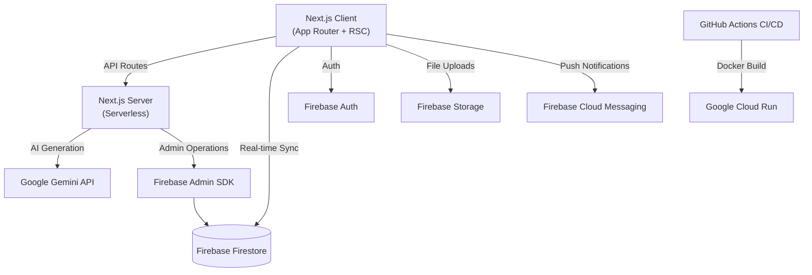

# 🌐 SyncSphere

> AI-powered workspace that unifies tasks, real-time chat, and team visibility into one elegant interface.


---

## 📸 Screenshots

> Screenshots will be added after the first successful deployment.

---

## 🏗️ Architecture



---

## ✨ Features

### 1. Authentication & Workspaces
- Google Sign-In + Email/Password via Firebase Auth
- Create or join workspaces via invite code
- Role-based access: Owner, Admin, Member (Firestore Security Rules)
- Protected routes via `middleware.ts`

### 2. Kanban Task Board
- 5 columns: Backlog → To Do → In Progress → Review → Done
- Drag-and-drop via `@dnd-kit/core` (accessible, keyboard-navigable)
- Task detail dialog: title, description (markdown), assignee, due date, priority, tags, subtasks
- Real-time sync via Firestore `onSnapshot`
- Debounced search/filter bar

### 3. Real-Time Team Chat
- Channel-based messaging (#general, custom channels)
- File uploads to Firebase Storage (10MB limit)
- Emoji reactions on messages
- AI-generated message badges

### 4. Sphere AI (Gemini-Powered)
- **Summarize Channel** — condenses last 50 messages into action items
- **Generate Tasks from Chat** — extracts TODOs and creates Kanban cards
- **Smart Standup** — auto-generates daily standup from task activity
- **Meeting Notes → Tasks** — paste notes, get structured task list
- **Suggest Priority** — AI analyzes workload and recommends ordering
- Streaming responses via Gemini API
- Clear "AI Generated" badges on all output

### 5. Dashboard & Analytics
- Personal dashboard with stats cards (total, completed, in-progress, my tasks)
- Team velocity chart (Recharts) showing tasks completed per week
- Upcoming deadlines view

### 6. Notifications
- In-app notification center with unread badge
- Mark all read functionality

---

## 🛠️ Tech Stack

| Layer | Technology |
|-------|-----------|
| Frontend | Next.js 14 (App Router), TypeScript, Tailwind CSS, shadcn/ui |
| Backend | Next.js API Routes (serverless) |
| Database | Firebase Firestore (real-time) |
| Auth | Firebase Authentication |
| AI | Google Gemini API (`gemini-2.0-flash-exp`) |
| Storage | Firebase Storage |
| Charts | Recharts |
| DnD | @dnd-kit/core |
| Validation | Zod |
| Testing | Vitest + React Testing Library + Playwright |
| Deployment | Docker → Google Cloud Run |
| CI/CD | GitHub Actions |

---

## 🚀 Setup

### Prerequisites
- Node.js 20+
- Firebase project with Firestore, Auth, and Storage enabled
- Google Gemini API key

### 1. Clone & Install
```bash
git clone https://github.com/your-username/syncsphere.git
cd syncsphere
npm install
```

### 2. Configure Environment
```bash
cp .env.example .env.local
# Fill in your Firebase config and Gemini API key
```

### 3. Firebase Setup
```bash
npm install -g firebase-tools
firebase login
firebase init  # Select Firestore, Storage, and deploy rules
```

### 4. Run Locally
```bash
npm run dev
```
Open [http://localhost:3000](http://localhost:3000)

---

## 🧪 Testing

```bash
# Unit & integration tests
npm run test

# E2E tests (requires dev server running)
npm run e2e
```

---

## 📦 Deployment

### Docker (Cloud Run)
```bash
docker build -t syncsphere .
docker run -p 3000:3000 syncsphere
```

### Google Cloud Run
```bash
gcloud run deploy syncsphere --source . --region us-central1
```

### Cloud Build
```bash
gcloud builds submit --config cloudbuild.yaml
```

---

## 🔒 Security

- All secrets stored in `.env.local` (never committed)
- Firestore Security Rules enforce role-based access
- Messages are immutable (only reactions can be updated)
- Storage rules limit uploads to 10MB for authenticated users
- CSP, HSTS, X-Frame-Options headers in `next.config.mjs`
- Gemini API key is server-side only (never exposed to client)
- Rate limiting on API routes (token bucket)
- All user input validated with Zod schemas
- Markdown sanitized with DOMPurify

---

## ♿ Accessibility (WCAG 2.1 AA)

- Semantic HTML (`<main>`, `<nav>`, `<article>`, proper headings)
- Skip-to-main-content link
- All buttons have `aria-label`
- Focus-visible indicators
- Chat uses `aria-live="polite"`
- Dark mode toggle (respects `prefers-color-scheme`)
- `prefers-reduced-motion` respected
- Keyboard-navigable Kanban board

---

## 📊 Evaluation Criteria Checklist

| Criteria | Status | Details |
|----------|--------|---------|
| Code Quality | ✅ | Strict TS, Zod validation, ESLint, folder structure |
| Security | ✅ | Firestore rules, CSP headers, rate limiting, server-only secrets |
| Efficiency | ✅ | RSC, dynamic imports, debounced search, memoization |
| Testing | ✅ | Vitest + RTL + Playwright, CI workflow |
| Accessibility | ✅ | WCAG 2.1 AA, skip-link, ARIA, dark mode, reduced-motion |
| Google Services | ✅ | Auth, Firestore, Storage, Gemini, Cloud Run, Cloud Build |

---

## 📁 Project Structure

```
syncsphere/
├── app/                    # Next.js App Router
│   ├── api/                # API routes (ai, tasks)
│   ├── dashboard/          # Protected dashboard routes
│   ├── login/              # Auth page
│   ├── layout.tsx          # Root layout
│   └── page.tsx            # Landing page
├── components/             # UI components
│   ├── ai/                 # AI Assistant panel
│   ├── board/              # Kanban board components
│   ├── chat/               # Chat components
│   ├── dashboard/          # Dashboard/analytics
│   └── ui/                 # shadcn/ui primitives
├── lib/                    # Core utilities
│   ├── hooks/              # Custom React hooks
│   ├── auth-context.tsx    # Auth provider
│   ├── workspace-context.tsx # Workspace provider
│   ├── firebase.ts         # Firebase client config
│   ├── firebase-admin.ts   # Firebase Admin SDK
│   ├── gemini.ts           # Gemini client
│   ├── validations.ts      # Zod schemas
│   └── utils.ts            # Utilities
├── types/                  # TypeScript definitions
├── tests/                  # Vitest unit tests
├── e2e/                    # Playwright E2E tests
├── firestore.rules         # Firestore security rules
├── firestore.indexes.json  # Composite indexes
├── storage.rules           # Storage security rules
├── Dockerfile              # Multi-stage Docker build
├── cloudbuild.yaml         # Cloud Build config
└── .github/workflows/      # CI/CD pipelines
```

---

## 📝 Conventions

- **Commits**: Conventional Commits (`feat:`, `fix:`, `docs:`, `test:`)
- **TypeScript**: Strict mode, no `any`, no `@ts-ignore`
- **Components**: Atomic design (ui/ → features/ → layouts/)
- **Validation**: Zod schemas for all inputs

---

Built with ❤️ for the Hackathon 2026
